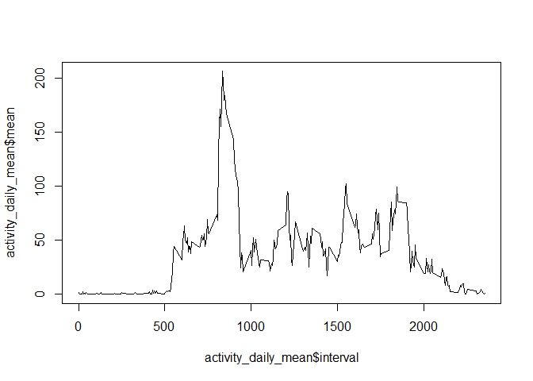
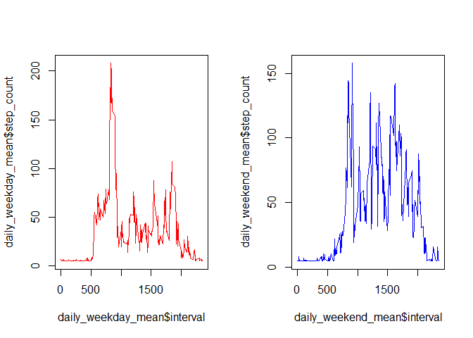

## Loading and preprocessing the data

```r
data <- read.csv("./activity.csv", header = TRUE, sep = ",", colClasses = c("numeric", "Date", "numeric"))
activity <- na.omit(data)
head(activity)
```

```
##     steps       date interval
## 289     0 2012-10-02        0
## 290     0 2012-10-02        5
## 291     0 2012-10-02       10
## 292     0 2012-10-02       15
## 293     0 2012-10-02       20
## 294     0 2012-10-02       25
```


## What is mean total number of steps taken per day?

```r
steps_per_day <- aggregate(activity$steps, by=list(activity$date), FUN = sum)
colnames(steps_per_day) <- c("date", "step_count")

hist(steps_per_day$step_count, breaks = 10)
```

<!-- -->


```r
mean(steps_per_day$step_count)
```

```
## [1] 10766.19
```


```r
median(steps_per_day$step_count)
```

```
## [1] 10765
```

## What is the average daily activity pattern?

```r
activity_daily_mean <- aggregate(activity$steps, by=list(activity$interval), FUN = mean)
colnames(activity_daily_mean) <- c("interval", "mean")
plot(x = activity_daily_mean$interval, y = activity_daily_mean$mean, type = "l")
```

<!-- -->


```r
max_int <- activity_daily_mean[which.max(activity_daily_mean$mean),]
```


## Imputing missing values


```r
na_count <- sum(!complete.cases(data))
data$steps[is.na(data$steps)] <- mean(data$steps, na.rm = T)
new_count <- sum(!complete.cases(data))

head(data)
```

```
##     steps       date interval
## 1 37.3826 2012-10-01        0
## 2 37.3826 2012-10-01        5
## 3 37.3826 2012-10-01       10
## 4 37.3826 2012-10-01       15
## 5 37.3826 2012-10-01       20
## 6 37.3826 2012-10-01       25
```

## Are there differences in activity patterns between weekdays and weekends?


```r
data$w_day <- weekdays(data$date)
data$day_type <- ifelse((data$w_day == "Samstag" | data$w_day == "Sonntag"), yes = "weekend", no = "weekday")

daily_weekday_mean <- subset(data, day_type == "weekday")
daily_weekend_mean <- subset(data, day_type == "weekend")

daily_weekday_mean <- aggregate(daily_weekday_mean$steps, by = list(daily_weekday_mean$interval), FUN = mean)
colnames(daily_weekday_mean) <- c("interval", "step_count")

daily_weekend_mean <- aggregate(daily_weekend_mean$steps, by = list(daily_weekend_mean$interval), FUN = mean)
colnames(daily_weekend_mean) <- c("interval", "step_count")

par(mfrow=c(1,2))
plot(x = daily_weekday_mean$interval, y = daily_weekday_mean$step_count, type = "l", col = "red")
plot(x = daily_weekend_mean$interval, y = daily_weekend_mean$step_count, type = "l", col = "blue")
```

<!-- -->
